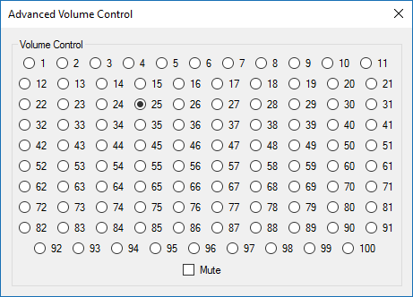
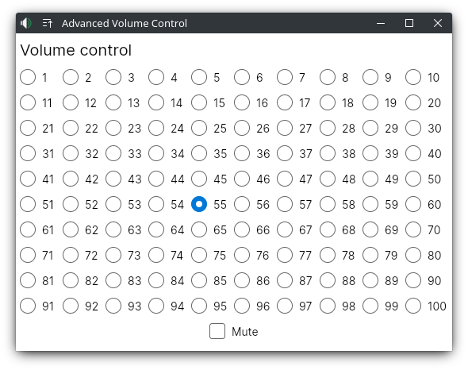

# Advanced Volume Control - Reimagined

This is an attempt to re-implement and reimagine goals of the original
[Advanced Volume Control](https://www.reddit.com/r/ProgrammerHumor/comments/6f2c4v/advanced_volume_control/)
app, using modern technologies, such as [.NET Core 6](https://dotnet.microsoft.com/en-us/) and [Avalonia UI](https://avaloniaui.net/).

Images with implemenation

### Original idea and implementation:

### Implementation of this project:

 

> **Why?**
> 
"Science isn't about WHY. It's about WHY NOT. Why is so much of our science dangerous? Why not marry safe science if you love it so much. In fact, why not invent a special safety door that won't hit you on the butt on the way out, because you are fired." — Cave Johnson (Portal 2)

## Building project

Get a dotnet core package, and run it via `dotnet run`.
Currently only Linux platform is supported, maybe some time later i'll add others.
